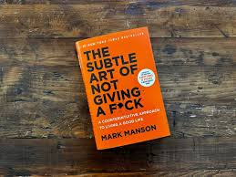

# THE FULFILLMENT HUB ReadME

## Project Overview
The Fulfillment Hub is a mental health awareness website designed to provide accessible resources, support, and guidance to help users improve their personal lives, relationships, and well-being. This project follows a brief focused on mental health and personal development.

[Visit the Fulfillment Hub](https://judewoolls.github.io/assessment-project-1/)

## Contents
1. [Features](#features)
2. [Technologies](#technologies)
3. [UX/UI](#ux-and-ui)
4. [Testing](#testing)
5. [Deployment](#deployment)
6. [Sources](#sources)
7. [Future Features](#future-features)
8. [Known bugs](#known-bugs)
9. [Acknowledgements](#acknowledgements)

## Features
* Navigation Bar
* About page
* Key points on mental health
* Emergency Support links
* Support Page
* Support Comparison tables
* Resources Page
* Links to more info for the resources
* footer with page links, contact info and social media links
* Responsive design

## Technologies
* **HTML5** - For page structure, semantics and content
* **CSS3** - for custom styling
* **Boostrap** - For layout and grid based design
* **Github copilot** - For pair programming
* **Microsoft Copilot** - Assisted in generating images for visual elements
* **ChatGPT** - for text content

## UX and UI

### Site goals
The aim of the website is to spread awareness for mental health issues and challenges and provide the user with access to resources for
emergency contacts or self development.

### Design Choices
Due to the site goals we want to encourage users to view the resources and contacts but also raise awareness of the issues. Therefore, I have
incldued links to resources and support in the nav bar and footer but also buttons on the main page to both resources.html and support.html and 
from resources.html to support.html. Furthermore to raise awareness and education on mental health the main index.html page includes sections on
key questions and issues.

### User stories
Throughout the development process these user stories where on a project board in the github repository.

**Must haves**

1. **The Navigation bar**
  **USER STORY:**
  As a visitor, I want to navigate the website easily, so I can quickly find resources and information without feeling overwhelmed.
  
  **Acceptance Criteria:**
  
  A navigation menu is present on every page.
  Pages are organized into clear sections (e.g., Resources, Support, Stories).
  
  **Tasks:**
  
  Design a navigation menu with links to key sections.
  Organize content into clear categories on each page.

2. **Footer**
  **USER STORY:**
 
  As a visitor, I want quick access to essential information and navigation links in the footer, so I can easily find what I need from any page.
 
  **Acceptance Criteria:**
  
  The footer includes links to important pages (e.g., About Us, Contact, Resources, Emergency Contacts).
  Social media icons are displayed and linked to the appropriate platforms.
  Contact information (email, phone number) is visible.
  A copyright notice and website name appear at the bottom.
  
 **Tasks:**
  
  Design a footer with clear sections: navigation links, contact info, and social media icons.
  Add links to key pages and test each link to ensure it works.
  Create and place a copyright notice with the current year.
  Style the footer to match the website’s overall theme and ensure it’s mobile-friendly.

3. **About Section**
 **USER STORY:**
 As a visitor, I want to understand the purpose of the website, so I can see how it can help me with mental health awareness.
 
 **Acceptance Criteria:**
 
 The homepage has a clear, concise mission statement.
 A "How We Can Help" section is visible on the homepage.
 
 **Tasks:**
 
 Write and add a mission statement to the homepage.

4. **Support Page**

 **USER STORY:**
 As a visitor, I want access to emergency contacts and support services, so I can get immediate help if needed.
 
 **Acceptance Criteria:**
 
 An "Emergency Contacts" link is prominently displayed.
 The emergency contacts page lists at least 3 reliable support services.
 
 **Tasks:**
 
 Research reputable mental health support services.
 Create and design an emergency contacts page. (support page)

**Should-haves**

1. **Support comparison and grouping**
 **User Story:**
 As a visitor, I want to compare different types of support and contact options, so I can choose the one that best fits my needs.
 
 **Acceptance Criteria:**
 
 A "Support Comparison" page lists multiple support options, including helplines, online chat services, in-person support, and self-help resources.
 Each support option includes a brief description, availability (e.g., 24/7 or specific hours), and links to access or learn more.
 A table or comparison chart organizes the options by criteria such as accessibility, type of support (e.g., emotional, crisis intervention), and target audience (e.g., youth, adults).
 
 **Tasks:**
 
 Research various mental health support options, including helplines, online chat support, counseling services, and community groups.
 Organize the options into a comparison chart with clear categories (e.g., hours of operation, type of support).
 Add links to access each service and ensure they’re up-to-date and functional.
 Style the comparison chart to ensure it’s visually clear and accessible on mobile and desktop views.

2. **Additional resources page**
 **User Story:**
 As someone seeking support, I want to find tips and resources for managing stress, anxiety, and other challenges, so I can improve my mental well-being.
 
 **Acceptance Criteria:**
 
 
 A "Coping Tips" page offers practical advice and resources.
 The page includes separate sections for stress, anxiety, and general mental health.
 
 **Tasks:**
 
 Research tips for managing stress and anxiety.
 Organise tips into easy-to-read sections.

**Could-haves (which are not completed)**
1. **Careers transition page**
 **User Story:**
 As a professional considering a career transition, I want advice on managing the mental impact of change, so I can stay calm and focused during the transition.
 
 **Acceptance Criteria:**
 
 A "Career Transition" section addresses mental health strategies for navigating career changes.
 The section includes tips for handling uncertainty, stress, and self-doubt.
 
 **Tasks:**
 
 Research mental health strategies for career changes.
 Write about stress management, resilience, and confidence-building tips.
 Create another HTML file for the new careers transition page

## Wireframes

## Testing

**HTML validation**: all three html files passed the validation test
**CSS validation**: the stylesheet passed the validation test
**Lighthouse test**:
  * Desktop score: 81
  * Mobile score: 71
Key improvements for this would be to compress images.

**Responsive design**

* [HTML Validator](https://validator.w3.org/)
* [CSS Validator](https://jigsaw.w3.org/css-validator/)
* [Lighthouse test](https://developer.chrome.com/docs/lighthouse/overview#devtools)
* [am i responsive?](https://amiresponsive.co.uk/)

## Deployment
To deploy the site I used GitHub pages and deployed from the main branch.

## Sources
[**Microsoft Copilot Images:**](https://copilot.microsoft.com/)

### Images

**Hero images**

**Index.html images**

## Resources.html images

**Background images**

**Card images**

**Support images**

## Future Features
**Careers transition page** - a future feature that I had included in the could-have user stories was a careers transiton page.
This page would include advice and resources specifically for changing jobs or progressing in careeer that help to manage the
stress and mental challenges that someone may face. This page would include the same navigation bar and footer and would also
have a button and prompts for the emergency contacts section.

## Known Bugs
A minor issue is that on ipads the *get support* button on the index.html hero section would be easier to see using a dark bootstrap
button instead of the dark-outline button. So I would change the button on small screens and keep it the same on large screens.

## Acknowledgements
* **Code Institute**: for guidance and resources
* **Microsoft Copilot**: for providing quick, royalty-free images that aligned with the project's theme

